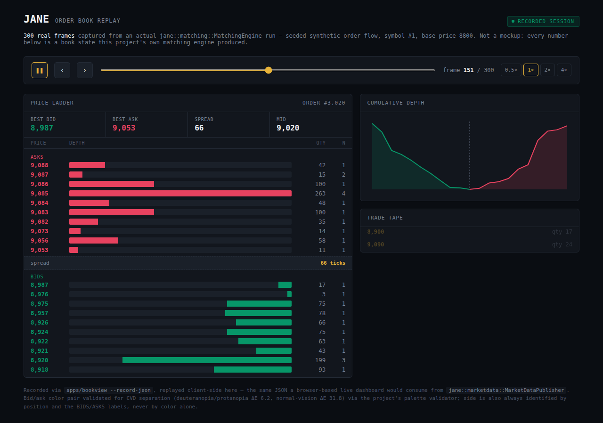
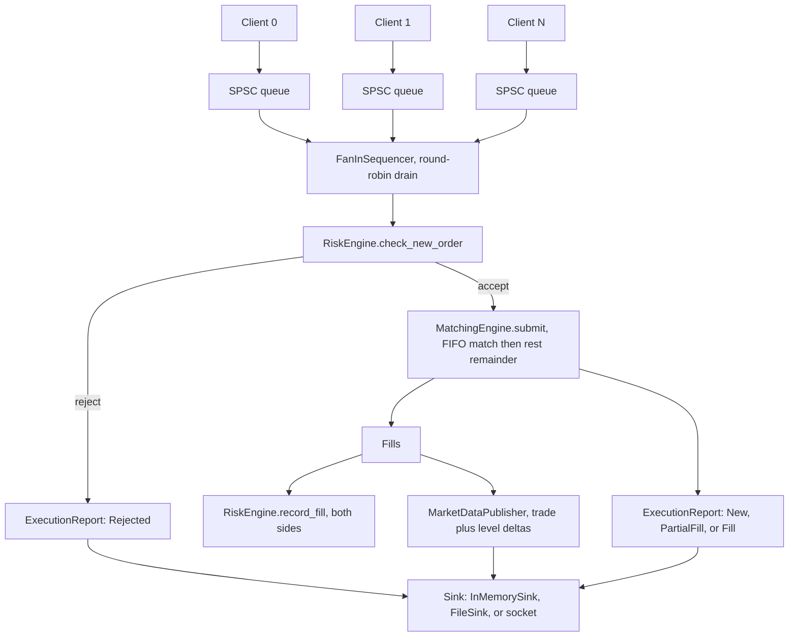

# JANE

[](https://github.com/sfeirc/Low-latency-exchange-simulator/actions/workflows/ci.yml)

[](LICENSE)

A from-scratch electronic exchange core, in modern C++23: order entry, a
price/time-priority limit order book, FIFO matching, pre-trade risk controls,
a binary market-data feed, and the plumbing (lock-free ring buffers, a slab
allocator, a wire protocol) that makes it all run without allocating or
locking on the hot path.

Built to be *measured*, not asserted: every number below came from `bench/`
running on a pinned core, reproducible via `tools/`. See
[`docs/tradeoffs.md`](docs/tradeoffs.md) for why each design decision was
made, with comparative data, not opinion.

## Why this matters across industries

A simulated exchange with a real price/time-priority matching engine, deterministic replay, and
measured (not claimed) latency is core market-infrastructure tooling — trading firms, exchanges, and
vendors all need exactly this kind of harness to test strategies and infrastructure before touching a
real venue. But the underlying systems-engineering discipline transfers well beyond finance: building
a deterministic simulation with a measured, realistic latency/throughput profile, and treating every
performance and correctness claim as something to benchmark and test rather than assert, is exactly
what's needed for any tech domain that requires a trustworthy test harness for a latency-sensitive
distributed system — a matching engine is, structurally, just a demanding single-writer state machine
fed by concurrent producers, a shape that recurs constantly outside trading. The same discipline
applies directly to industrial control-system testing too: simulating realistic network and latency
conditions to validate SCADA/ICS software under load is the same class of problem — a deterministic,
measurable stand-in for a real, hard-to-instrument production environment.

## The order book, live

<p align="center">
  
</p>

<p align="center">
  <em>Frame 151/300 (order #3,020) of a real seeded session — every number on screen is
  actual <code>jane::matching::MatchingEngine</code> output, nothing drawn for effect.</em>
</p>

This is a static capture of
[`artifacts/book_animation.html`](artifacts/book_animation.html), a
self-contained, interactive replay: download it and open it in a browser
(no server, no build needed) to scrub through all 300 frames, hover the
depth chart for tooltips, and watch the trade tape fill in. It's produced
by [`apps/bookview`](apps/bookview/main.cpp), which drives the *real*
pipeline — `ReplayEngine` over `MatchingEngine` + `RiskEngine` +
`MarketDataPublisher` — through seeded synthetic order flow and can also
render the same book live as an ANSI terminal ladder:

```sh
./build/apps/bookview --seed=2026 --orders=6000 --interval=20 --depth=10
```

## Architecture



Everything from the sequencer's drain onward runs on **one thread** —
`MatchingEngine`, `OrderBook`, and `RiskEngine` contain no locks or atomics
anywhere in their implementation. Concurrency is deliberately pushed to the
ingestion edge (one wait-free `SPSCRingBuffer` per client, fanned in by
round-robin) specifically so the matching core's correctness invariants only
ever have to be proven against sequential input, not concurrent mutation.
Full reasoning, the alternative MPSC/CAS ingestion design, and a
message-by-message trace of one order through the whole pipeline:
[`docs/architecture.md`](docs/architecture.md).

## Features

- [x] Limit order book: price/time priority, FIFO per price level
- [x] Order types: limit, market, cancel, replace
- [x] FIFO matching with partial fills
- [x] Market data: full snapshots + incremental deltas
- [x] Deterministic replay (historical log or seeded synthetic flow) for bug repro
- [x] Pre-trade risk: max order size, max position, max loss, kill switch
- [x] Strategy simulators: market maker, VWAP, arbitrage
- [x] Latency benchmarks: p50/p99/p99.9 per operation, measured not claimed
- [x] Correctness suite: volume conservation, strict FIFO, no crossed/impossible trades

Every box above is backed by tests, not just present in source.

## Benchmarks

**Machine:** AMD Ryzen 9 5900X (12C/24T), Ubuntu, GCC 15.2, one physical core
pinned, `-O3 -march=native`, LTO, no sanitizers. Full methodology (why two
different measurement techniques are used, and for what) and every
comparative trade-off benchmark: [`docs/benchmarks.md`](docs/benchmarks.md).

**Full pipeline, per order** — sequencer → pre-trade risk → matching →
market-data publication, one call per sample, 500,000 samples of realistic
synthetic flow:

| Percentile | Latency |
|---|---:|
| p50 | 110 ns |
| p99 | 1.69 µs |
| p99.9 | 4.06 µs |
| max (of 500,000 samples) | 179 µs |

**Component level** (Google Benchmark aggregate mean):

| Operation | Latency |
|---|---:|
| Order book add + cancel round trip | 25 ns |
| Order book `best_bid()` query | 6.7 ns |
| Matching engine: non-crossing submit + cancel | 40 ns |
| Matching engine: crossing submit (1 fill) | 288–530 ns |
| Matching engine: sweep 10 resting orders | ~1.1–1.3 µs |
| Protocol encode / decode (`NewOrderMessage`) | 0.87 ns / 7.3 ns |
| SPSC ring buffer, single-threaded round trip | 1.4 ns |
| SlabPool alloc + dealloc (immediate cycle) | 1.1 ns |

One comparative result worth calling out here: the multi-producer ingestion
path fanning N `SPSCRingBuffer`s into one sequencer beats a single
CAS-based MPSC ring buffer at every producer count tested, reaching
**22.2M items/s at 8 producers vs. 6.7M items/s** for the shared-buffer
design — the concrete payoff for pushing concurrency to the edge described
in Architecture above. Every other head-to-head (SPSC cached-vs-naive index,
price-index ladder-vs-tree-vs-vector, SlabPool-vs-`pmr`-vs-`new`/`delete`) is
in [`docs/tradeoffs.md`](docs/tradeoffs.md), with the reasoning, not just the
numbers.

Reproduce all of it:

```sh
./tools/run_benchmarks.sh                              # builds Release, pins to an isolated core, writes artifacts/*.json
python3 tools/analyze_benchmarks.py artifacts/*.json    # human-readable summary
```

## Correctness

A benchmark number is worthless if the thing being measured is wrong.
Every property below is checked by an automated test — not just claimed —
and this project's one real data-corruption bug was caught by the
property-based session test, not by any example-based unit test. Full
write-up, with the exact test for every claim:
[`docs/correctness.md`](docs/correctness.md).

| Property | How it's checked |
|---|---|
| **Conservation of volume** — a price level's cached aggregate quantity always equals what its FIFO list actually contains | An independently-walked structural check after *every* action in an 8,000-iteration randomized session, cross-checked against a fully separate per-order ledger the test maintains itself |
| **Strict FIFO** (price/time priority) — orders at a level match in arrival order, unmoved by partial fills | Structural tests on the intrusive linked list, plus end-to-end tests asserting fill order and FIFO position surviving a partial fill |
| **No crossed or impossible trades** — the book never shows `best_bid >= best_ask`; every fill executes at the resting order's price (price improvement only, never degradation) | Checked on every step of the same 8,000-iteration property test; `MatchingEngine::replace()` specifically tested against the one realistic way to rest a crossed book |
| Fill-or-Kill is genuinely all-or-nothing | Read-only pre-trade liquidity check before any mutation; tested at, above, and below the exact liquidity boundary |
| Pools never silently misbehave under exhaustion | Typed error, never corruption; 1,000-round randomized allocate/deallocate cycle |
| Lock-free structures are actually race-free | Verified under ThreadSanitizer, not just reasoned about |

**174 test cases, 10,584,859 assertions** — clean under both a default build
and ASan/UBSan/`-Werror`, plus a dedicated TSan pass over the concurrency
primitives.

## Repository layout

```
include/jane/    public headers (the engine is largely header-only templates)
  core/          strong types: Price, Quantity, OrderId, Sequence, ClientId, SymbolId, Nanos, PnL, Order
  concurrency/   SPSC/MPSC ring buffers, multi-client fan-in sequencer
  memory/        slab allocator / pmr pools
  protocol/      binary wire messages, encode/decode
  book/          limit order book (ladder / flat-vector / std::map backends)
  matching/      matching engine
  risk/          pre-trade risk gate
  marketdata/    snapshot + incremental feed publisher
  replay/        replay engine + synthetic order-flow generator
  strategy/      market maker / VWAP / arbitrage simulators
  metrics/       latency histograms, counters
  correctness/   structural invariant checker (volume, FIFO, no crossed book)
src/             non-template implementation
apps/            bookview: live terminal order-book viewer + JSON session recorder
tests/           Catch2 unit + property/invariant tests
bench/           Google Benchmark micro + end-to-end harness
tools/           benchmark runner (shell) + results analyzer (Python)
artifacts/       benchmark results (JSON) and the recorded-session animation (HTML)
docs/            architecture, benchmarks, trade-offs, correctness write-ups
```

## Building

Dependencies: a C++23 compiler (developed against GCC 15), CMake >= 3.25, Ninja,
Catch2 3, Google Benchmark.

```sh
sudo apt-get install -y ninja-build catch2 libbenchmark-dev

cmake -S . -B build -G Ninja -DCMAKE_BUILD_TYPE=RelWithDebInfo
cmake --build build -j"$(nproc)"
ctest --test-dir build --output-on-failure
```

Useful CMake options (see root `CMakeLists.txt`):

| Option | Default | Purpose |
|---|---|---|
| `JANE_NATIVE_ARCH` | `ON` | `-march=native`; disable for portable binaries / CI |
| `JANE_ENABLE_LTO` | `ON` | interprocedural optimization on Release-like configs |
| `JANE_ENABLE_ASAN` | `OFF` | Address+UB sanitizers (Debug) |
| `JANE_ENABLE_TSAN` | `OFF` | ThreadSanitizer (Debug, exclusive with ASan) |
| `JANE_WERROR` | `OFF` | warnings as errors |

## License

MIT — see [`LICENSE`](LICENSE).
